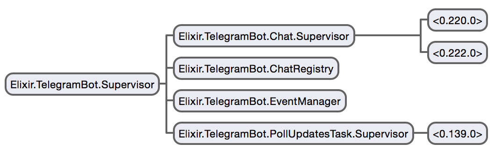

TelegramBot - A Telegram Bot written in Elixir
==============

How to run:
-----------

1. `mix deps.get`
2. Edit `config/config.exs`
3. `env MIX_ENV=prod mix compile`
3. `env MIX_ENV=prod mix run --no-halt`
